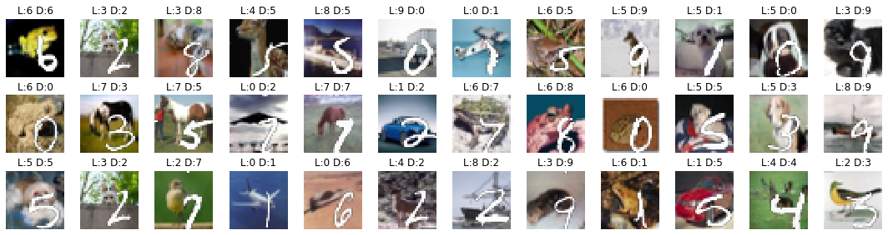

# Overlayed-Datasets
Datasets consisting of overlayed images. The idea of overlaying datasets came after reading [Information Dropout](https://arxiv.org/abs/1611.01353).


## Use Precomputed datasets
2 precomputed datasets can be found in `data/` (the images, labels, and distracting - overlayed - labels), namely `CIFAR10 + MNIST` and `MNIST + OMNIGLOT`. Here are some examples for both of these:




The first label is the real (background), while the second corresponds to the distractor (overlayed) label.
The code to generate those, and examples with additional arguments can be found [examples.ipynb](/examples.ipynb).

## Generate Your Own
To generate your own, you need `overlay_img` (or the wrapper `overlay_save_datasets` if you directly want to save it).
The main documentation is in the following docstring:

```python
def overlay_img(bckgrnd, to_overlay, is_shift=False, seed=123):
    """Overlays an image with black background `to_overlay` on a `bckgrnd`
    
    Parameters
    ----------
    bckgrnd : np.array, shape=[n_bckgrnd, height_bckgrnd, width_bckgrnd, ...], dtype=uint8
        Background images. Each image will have one random image from  `to_overlay` overlayed on it.
    
    to_overlay : np.array, shape=[n_overlay, height_overlay, width_overlay, ...], dtype=uint8
        Images to overlay. Currently the following assumptions are made:
            - the overlaid images have to be at most as big as the background ones (i.e. 
              `height_bckgrnd <= height_bckgrnd` and `<= width_bckgrnd`).
            - The overlayed images are also used as mask. This is especially good for black 
              and white images : whiter pixels (~1) are the ones to be overlayed. In the case
              of colored image, this still hold but channel wise.

    is_shift : bool, optional
        Whether to randomly shift all overlayed images or to keep them on the bottom right.
        
    seed : int, optional
        Pseudo random seed.
        
    Return
    ------
    imgs : np.array, shape=[n_bckgrnd, height, width, 3], dtype=uint8
        Overlayed images.
        
    selected : np.array, shape=[n_bckgrnd], dtype=int64
        Indices of the slected overlayed images.
    """
```